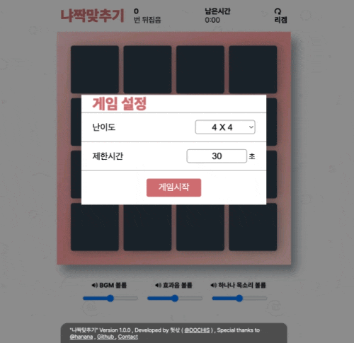

# 나나티콘을 사용한 카드 맞추기 게임

이 게임은 삼색미 카페의 나나제철 님께서 제작해주신 나나티콘을 사용한 카드 맞추기 게임입니다.

## 데모
게임의 데모는 [여기](https://dochis.github.io/hananacard/)에서 확인할 수 있습니다.

## 기능 소개
- 2x2, 4x4, 6x6, 8x8 크기의 카드 짝 맞추기 게임을 할 수 있어요
- 제한시간을 설정해 제한시간 내 퍼즐을 풀어보세요
- 시청자와 특정 시간 내 풀기 미션을 통해 내기를 할 수 있어요

## 라이센스
### 게임 개발
- 게임 기능 추가: [링크](https://www.afreecatv.com/sack2022)
- 개발자: 헛삯
- 라이센스: MIT

### 케릭터 및 오디오 저작권
- 저작자 링크: [링크](https://bj.afreecatv.com/17282486)
- 저작자 : 하나나
- 라이센스: Unknown

### 나나티콘
- 나나티콘: [링크](https://cafe.naver.com/tkatoral/12272)
- 제작자: 나나제철
- 라이센스: Unknown

## 서드파티
- [toastify.js](https://www.npmjs.com/package/toastify-js) : MIT 라이센스
- [Matching Card Game](https://codepen.io/dianaramirez16/pen/QVWzej) : MIT 라이센스
- [font-awesome](https://github.com/FortAwesome/Font-Awesome) : SIL OFL 1.1 라이센스
- [pretendard](https://github.com/orioncactus/pretendard) : SIL OFL 1.1 라이센스
- [effect](https://github.com/JJoriping/KKuTu) : 크리에이티브 커먼즈 라이선스 CC BY

기타 문의 사항은 헛삯의 방송국으로 문의해주세요.